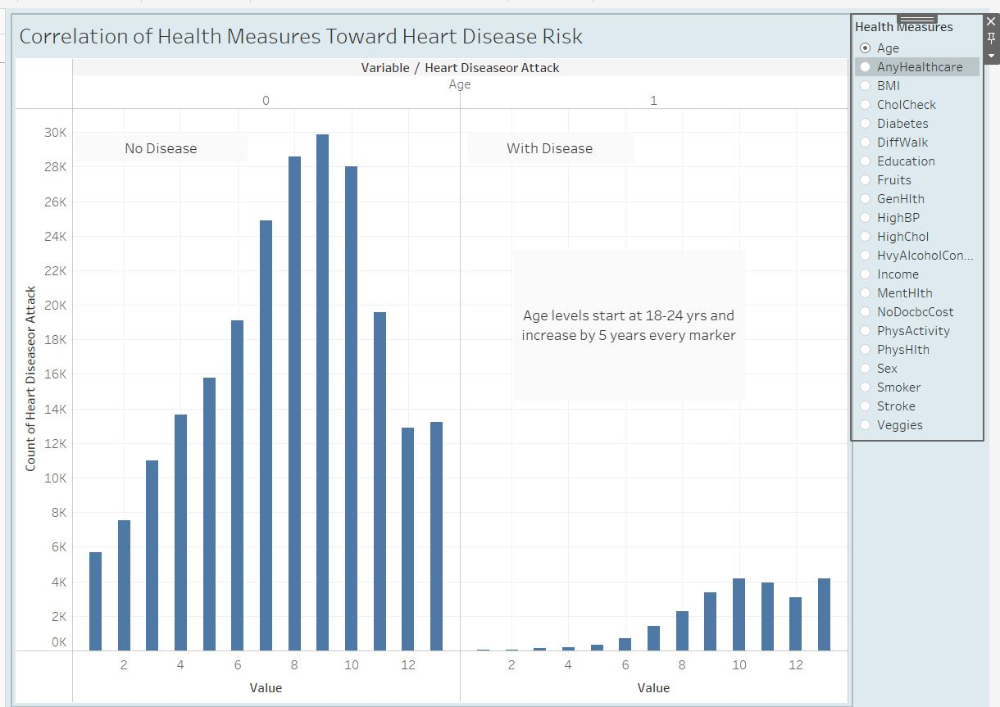
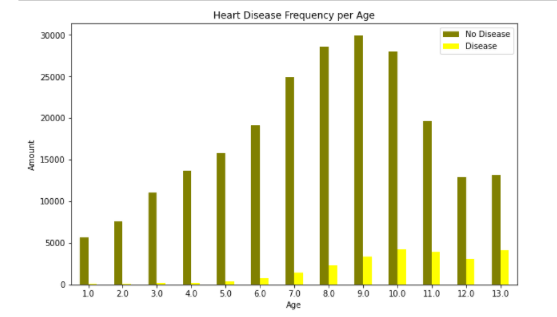
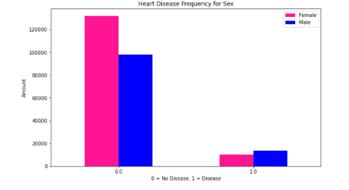
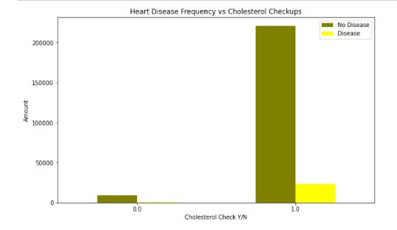
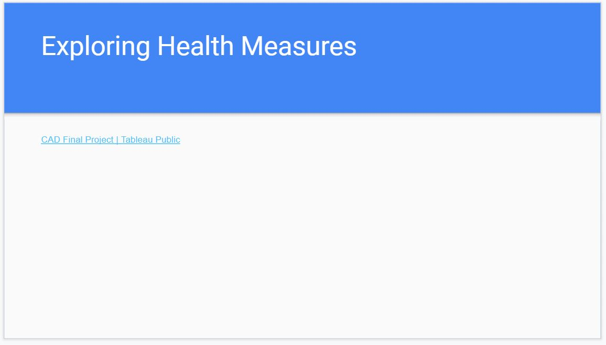
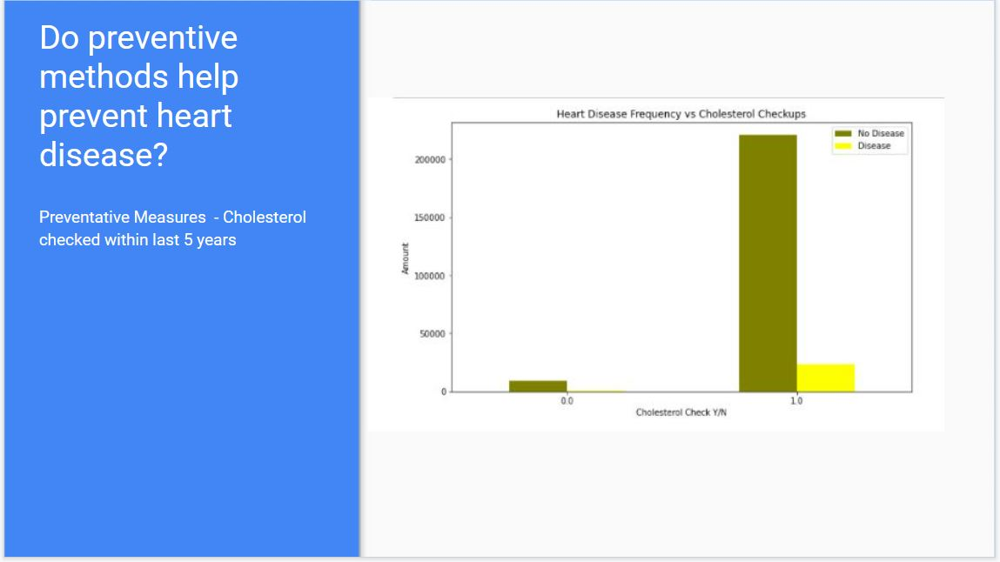

# Final-Project

## ERD diagram

## SQL table schema
table_schema.sql

## Data Files
* heart_disease_health_indicators_BRFSS2015.csv

* avg_bmi.csv

## Link to Dashboard - Tableau Public (second segment)
https://public.tableau.com/app/profile/robin8031/viz/CADFinalProject/Dashboard1?publish=yes

Added image files for presentation

## StoryBoard outline (second segment)

